# Numerical Optimization Assignment Report

Github link: [https://github.com/sacha-is/line_search_minimization](https://github.com/sacha-is/line_search_minimization)

## 1. Introduction

This report documents the implementation and results of unconstrained minimization algorithms (Gradient Descent and Newton’s Method) applied to several test functions. The code is modular, with a clear separation between user interaction, algorithm logic, and utility functions.

## 2. Code Structure

- `main.py`: Main entrypoint, handles user interaction and algorithm selection.
- `src/unconstrained_min.py`: Contains the implementations of Gradient Descent and Newton’s Method.
- `src/utils.py`: Utility functions for plotting and user input.
- `tests/examples.py`: Definitions of test functions (quadratic, Rosenbrock, linear, corner triangle).
- `tests/test_unconstrained_min.py`: Automated tests and plotting for all algorithms and functions.

## 3. How to Run the Code

Install dependencies:
```bash
pip install -r requirements.txt
```

Run the interactive program:
```bash
python main.py
```

Run all tests and generate plots:
```bash
python -m unittest tests/test_unconstrained_min.py
```

## 4. Results and Screenshots

To generate the required screenshots for your report, run the following command:
```bash
python -m unittest tests/test_unconstrained_min.py
```
This will display contour plots and objective value plots for each function and algorithm.

| Function           | Contour Plot with Path                                         | Objective Value Plot                                 |
|--------------------|---------------------------------------------------------------|------------------------------------------------------|
| Circle             | 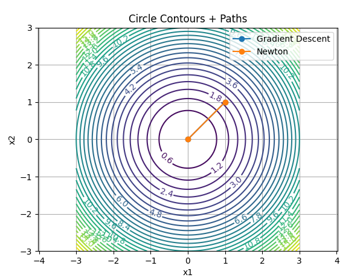             | 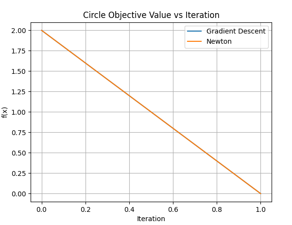 |
| Ellipse            | 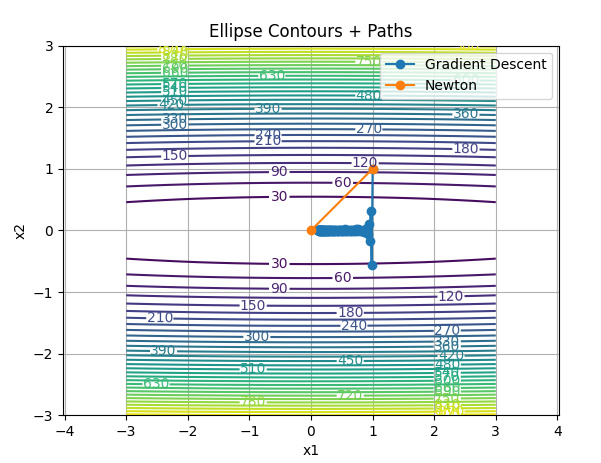           | 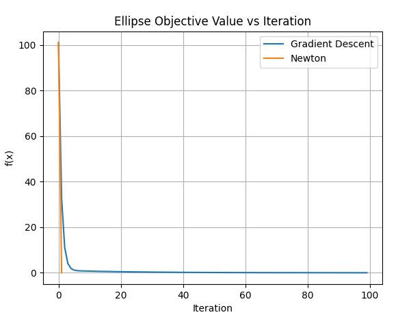 |
| Rotated Ellipse    | 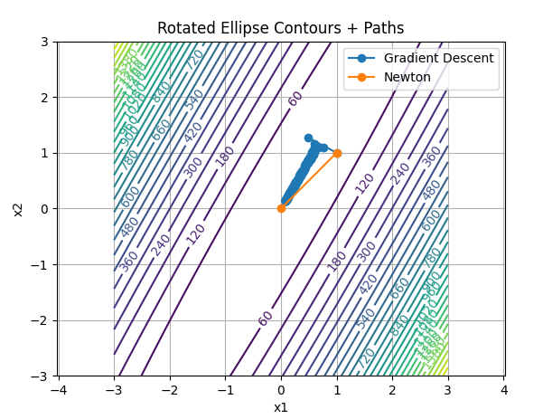 | 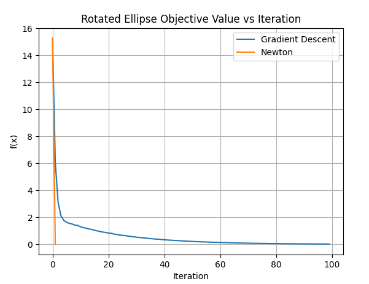 |
| Rosenbrock         | 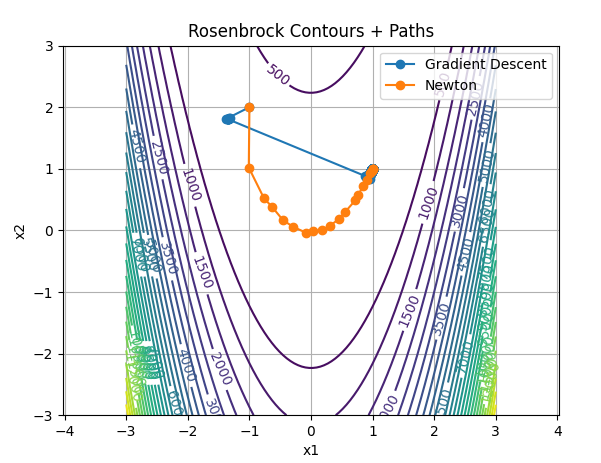     | 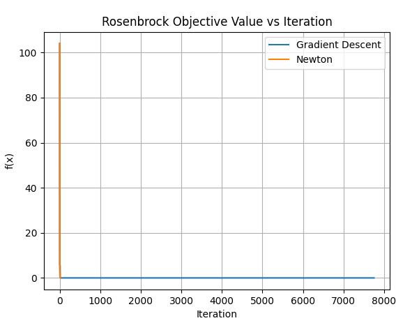 |
| Linear             | 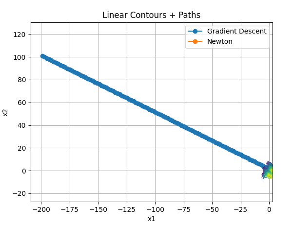             | 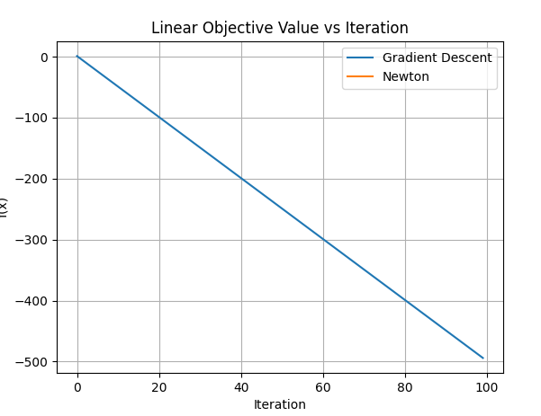 |
| Corner Triangle    | 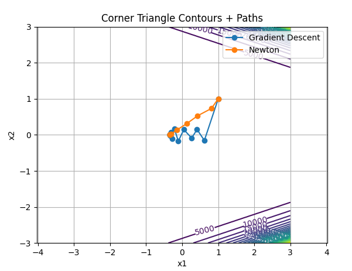 | 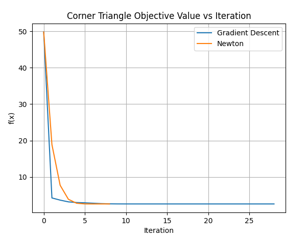 |


Final outputs 
Circle:
```
Circle GD Final: x=[0. 0.], f=0.0, success=True
Circle NT Final: x=[0. 0.], f=0.0, success=True
```

Triangle:
```
Corner Triangle GD Final: x=[-3.46572886e-01 -9.76799665e-07], f=2.5592666966643445, success=True
Corner Triangle NT Final: x=[-3.46573590e-01  3.54155282e-18], f=2.5592666966582156, success=True
```

Ellipse:
```
Ellipse GD Final: x=[0.11271997 0.0008856 ], f=0.012784220095399295, success=False
Ellipse NT Final: x=[0. 0.], f=0.0, success=True
```
Linear:
```
Linear GD Final: x=[-199.  101.], f=-499.0, success=False
Linear NT Final: x=[1. 1.], f=1.0, success=False
```
Rosenbrock:
```
Rosenbrock GD Final: x=[0.99989437 0.99978771], f=1.1267173492334944e-08, success=True
Rosenbrock NT Final: x=[1. 1.], f=6.668339839446365e-30, success=True
```
Rotated ellipse:
```
Rotated Ellipse GD Final: x=[0.07682763 0.13062022], f=0.023112584192700566, success=False
Rotated Ellipse NT Final: x=[4.93038066e-32 4.93038066e-32], f=3.710347676019499e-62, success=True
```