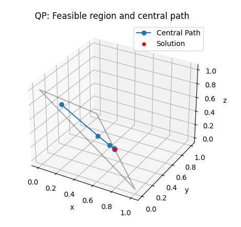
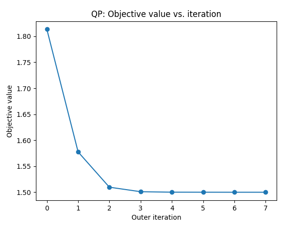
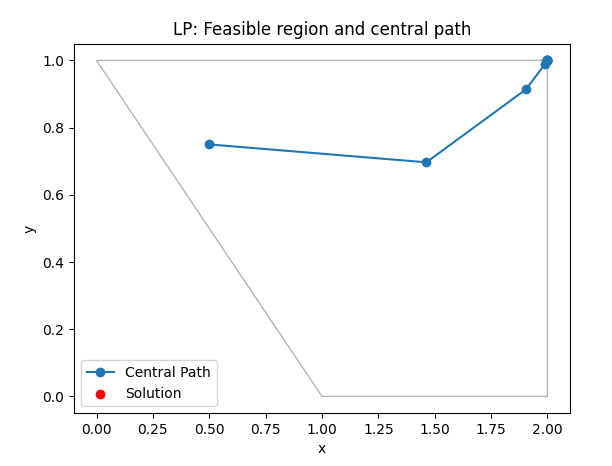

# Numerical Optimization with Python – Programming Assignment 02

---

Github link: [https://github.com/sacha-is/line_search_minimization](https://github.com/sacha-is/line_search_minimization)

---

## Quadratic Programming Example
This report documents the implementation and results of constrained minimization algorithms with interior point method solver applied to several test functions. 

### Problem Statement

Minimize:  
$$
x^2 + y^2 + (z+1)^2
$$

Subject to:  
- $x + y + z = 1$
- $x \geq 0$
- $y \geq 0$
- $z \geq 0$

Initial point: $(0.1, 0.2, 0.7)$

---

### 1. Feasible Region and Central Path (3D Plot)

)


---

### 2. Objective Value vs. Outer Iteration




---

## Linear Programming Example

### Problem Statement

Maximize:  
$$
x + y
$$

Subject to:  
- $y \geq -x + 1$
- $y \leq 1$
- $x \leq 2$
- $y \geq 0$

Initial point: $(0.5, 0.75)$

---

### 1. Feasible Region and Central Path (2D Plot)



---

### 2. Objective Value vs. Outer Iteration


---

## Program Outputs
```
QP final solution: [ 5.00025019e-01  5.00024988e-01 -5.00071179e-05]
QP objective value: 1.4999499966331717
QP constraint (sum): 1.0000000000000002 ineqs: [0.5000250189528428, 0.5000249881650539, -5.0007117896623885e-05]
LP final solution: [2.00007984 1.00007984]
LP objective value: -3.0001596804984825
LP constraints: [2.0001596804984825, -7.984029058039077e-05, -7.984020790186008e-05, 1.0000798402905804]
```
